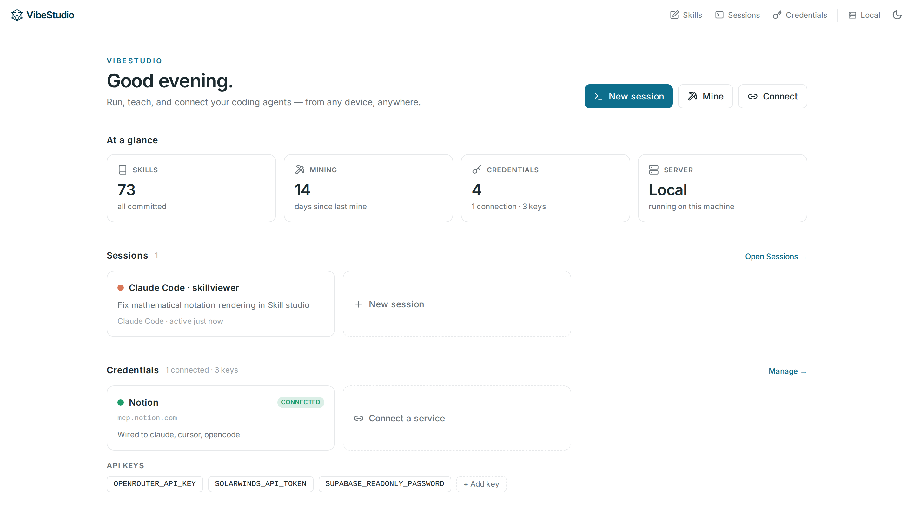

# Skill Studio

The best human interface for **[Agent Skills](https://agentskills.io/home)**. Available on macOS, Linux, and Windows.



We love [agent skills](https://agentskills.io/home). As agents get more powerful, it's easy to feel like losing control over the direction of your project or organization. We think agent skills is the right place to specify your taste, expertise, and customize your way of doing things on an organization level. 

There just isn't a good human interface for editing agent skills. Any place that requires human creativity needs a good human interface: clean, intuitive, version controlled. So we built one and open-sourced it. 

Built with [Tauri](https://tauri.app/), Skill Studio runs on macOS, Linux, and Windows, and connects to any remote dev setup you have natively VS Code style (see [`design.md`](./design.md)). 

## Features

- **Discover** and manage every skill on your machine, across Claude Code, Codex, opencode,
  Cursor, Gemini CLI, OpenClaw, the shared `~/.agents/skills` standard, and project repos.
- **Skill Mining** — use your local agent to analyze past agent conversations to create / update skills.
- **Edit rendered markdown directly** — view and edit `SKILL.md` and other Markdown files directly on the rendered document. Double click to edit the raw markdown syntax. 
- **Automatic versioning** — automatically track changes across all your skills and sync to any remote you specify
- **Secrets manager** — machine-local store. Automatically detect secrets used and notice on export for "batteries included" sharing of the skills. 
- **Terminals & remote hosts** — managed agent sessions that survive UI disconnect, so you can close your laptop and pick the run back up later. Point Studio at any SSH host and run agents there. Supports Claude Code, Codex, opencode, or a shell. 

## Install

Grab the latest build for your platform:

| Platform | |
|----------|--|
| **macOS** — Apple silicon & Intel | [Download](https://github.com/AltrinaAI/skill-studio/releases/latest/download/Skill-Studio-macOS.dmg) |
| **Windows** | [Download](https://github.com/AltrinaAI/skill-studio/releases/latest/download/Skill-Studio-Windows-x64-setup.exe) |
| **Linux** — Debian/Ubuntu | [Download](https://github.com/AltrinaAI/skill-studio/releases/latest/download/Skill-Studio-Linux-x86_64.deb) |

### First launch

Windows builds aren't code-signed yet, so each shows a one-time prompt:

- **Windows** — SmartScreen shows "Windows protected your PC". Click **More info → Run anyway**.
- **Linux** — install the package with `sudo apt install ./Skill-Studio-Linux-x86_64.deb`.

## Use from a browser (phone included)

The backend serves the full app over plain HTTP — a browser pointed at a running
`skill-server` **is** Skill Studio, terminals included.

**In the app:** click the **Local** pill → **Open on your phone…** → scan the QR.
The app fronts its own server with [Tailscale](https://tailscale.com) (free) and
walks you through the two one-time Tailscale permissions if needed. Any device
signed in to your Tailscale network can open the URL. Closing the window keeps
Skill Studio (and phone access) running in your tray; right-click the tray icon
to quit entirely.

**By hand** (headless machines, or no desktop app):

```bash
npm run build                 # SPA → ./dist
cargo run -p skill-server     # serves UI + API on 127.0.0.1:8765
tailscale serve --bg 8765     # https://<machine>.<tailnet>.ts.net → any device
```

Notes:

- Run `skill-server` from the repo/app directory (bundled skills and example
  paths resolve relative to the working dir).
- The server must sit at the **root** of the origin (plain `tailscale serve`
  does this); sub-path mounts aren't supported.
- Leave `--token` off for browser use — reachability is the auth boundary
  (loopback bind + your tailnet). Anyone who can open the URL has full control
  of skills, terminals, and onward SSH remotes, so treat the tailnet as trusted.
- The installed desktop app can be fronted the same way: launch it with
  `SKILL_STUDIO_PORT=8765` to pin its (otherwise ephemeral) local server port.

## Build from source

Install Rust, Node.js/npm, and the [Tauri prerequisites](https://tauri.app/start/prerequisites/) for your OS, then:

```bash
git clone https://github.com/AltrinaAI/skill-studio.git
cd skill-studio
npm install
npm run tauri -- build
```

The built app bundle is written under `client/desktop/target/release/bundle/`.

## Development

```bash
npm install
npm run dev          # native desktop
```

| Mode | Command | Open |
|------|---------|------|
| Native desktop | `npm run dev` | the app window |
| Browser, local backend | `cargo run -p skill-server` + `npm run dev:vite` | `localhost:1420` |

## Roadmap

The thesis: the future is one where humans **collaborate** with AI agents, not one where they are replaced by them. Skills are the medium for human expert knowledge, so they need a
first-class human UX. Next:

1. **Team collaboration & secret management** — share skills and the secrets they need across a team, account-backed. 
2. **Multi-modal skills / SOP documents** in a format readable by both humans and agents, for computer use agents. 
